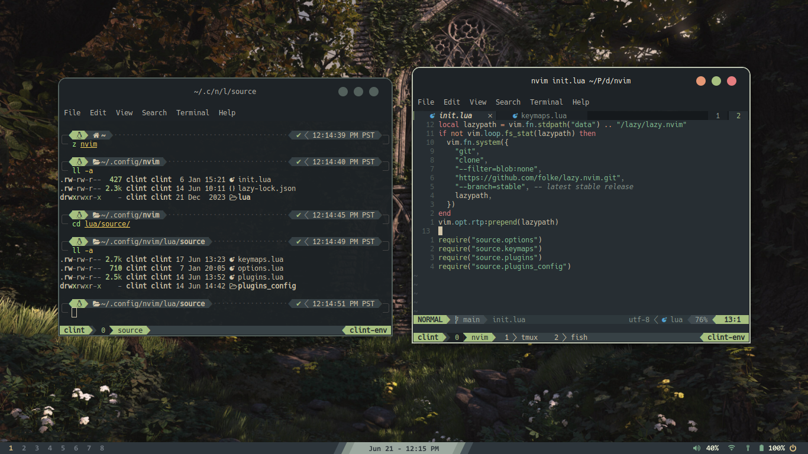

## Neovim setup
- [Neovim](https://github.com/neovim/neovim/blob/master/INSTALL.md)
- [lazy.nvim](https://github.com/folke/lazy.nvim)
- [Nerdfont](https://www.nerdfonts.com/) for displaying icons
- [Everforest](https://github.com/neanias/everforest-nvim)

## Shell setup
- [Fish](https://github.com/fish-shell/fish-shell)
- [Fisher](https://github.com/jorgebucaran/fisher)
- [Tide](https://github.com/IlanCosman/tide)
- [Nerdfont](https://www.nerdfonts.com/)
- [z](https://github.com/jethrokuan/z) for directory jumping
- [eza](https://github.com/eza-community/eza) for better looking ls

## Credits
Most of my setup is inspired by [craftzdog](https://github.com/craftzdog/).
